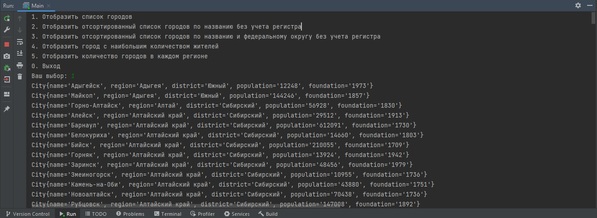
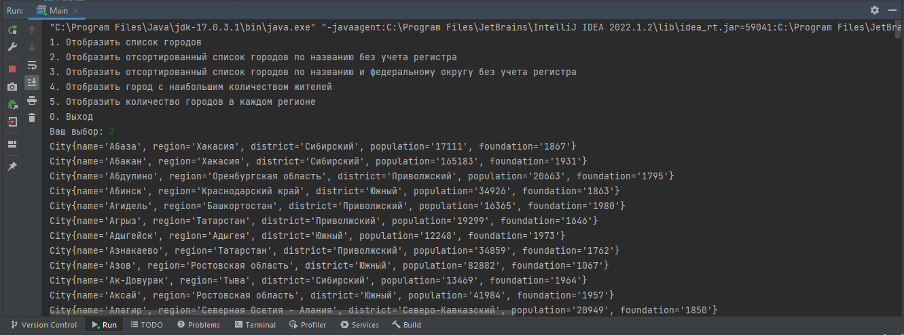
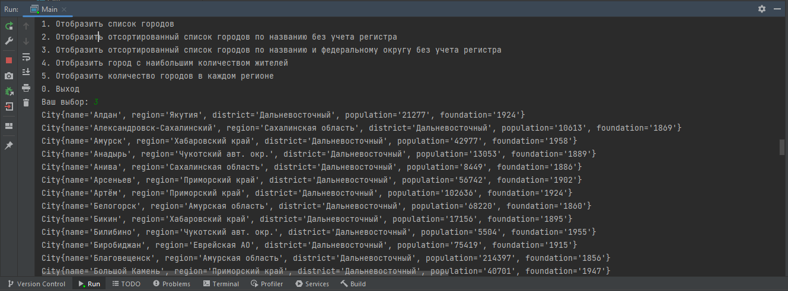
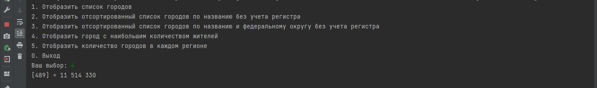
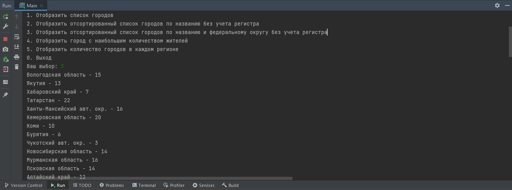

# Стажировка по направлению "Java" в Сбере

## Описание
Справочник городов, в котором предусмотрены следующие функции:
1. Загрузка справочников городов России
2. Реализация нескольких вариантов сортировки данных справочника
3. Поиск города с наибольшим количеством жителей
4. Поиск количества городов в разрезе регионов

## Задача - 1
**Необходимо реализовать класс Main, используя java.util.Scanner, прочесть информацию из текстового представления справочника и разложить данные в модель City с полями:**

* name – наименование города
* region - регион
* district – федеральный округ
* population – количество жителей города
* foundation – дата основания или первое упоминание

### Список всех объектов.

## Задача - 2
*Необходимо реализовать следующие варианты сортировки:**

* Сортировка списка городов по наименованию в алфавитном порядке по убыванию без учета регистра;
* Сортировка списка городов по федеральному округу и наименованию города внутри каждого федерального округа в алфавитном порядке по убыванию с учетом регистра;

### Первый вариант сортировки городов.

### Второй вариант сортировки городов.

## Задача - 3
Необходимо преобразовать список городов в массив и путем перебора массива найти индекс элемента и значение с наибольшим количеством жителей города.

## Задача - 4
Необходимо определить количество городов в разрезе регионов.

